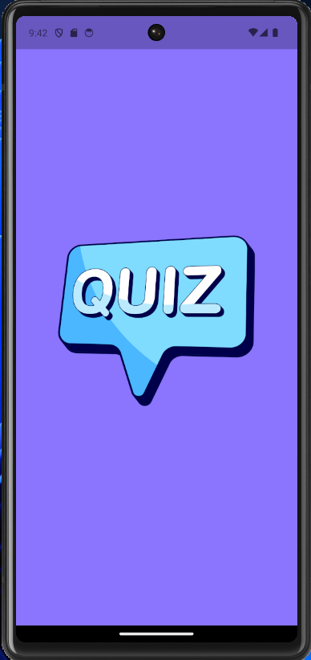
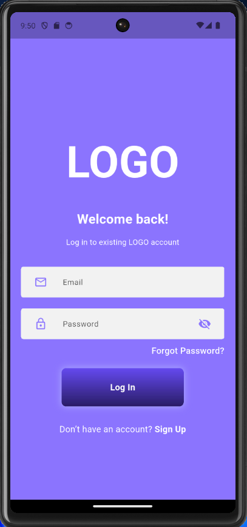
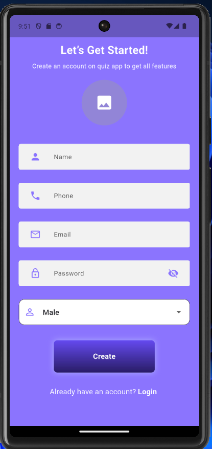
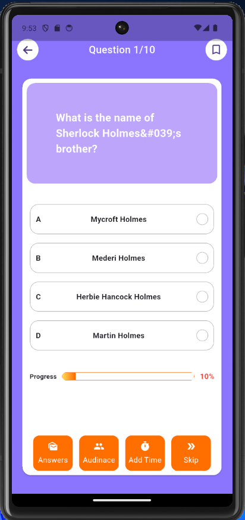
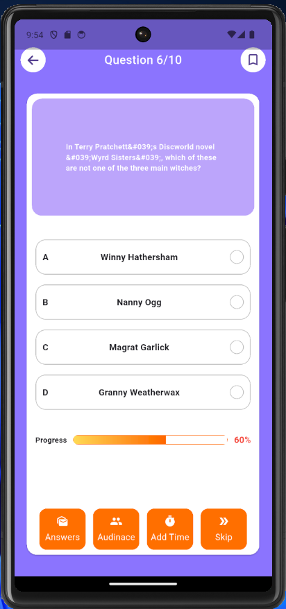
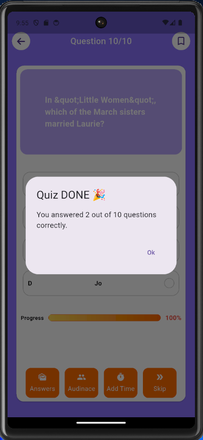
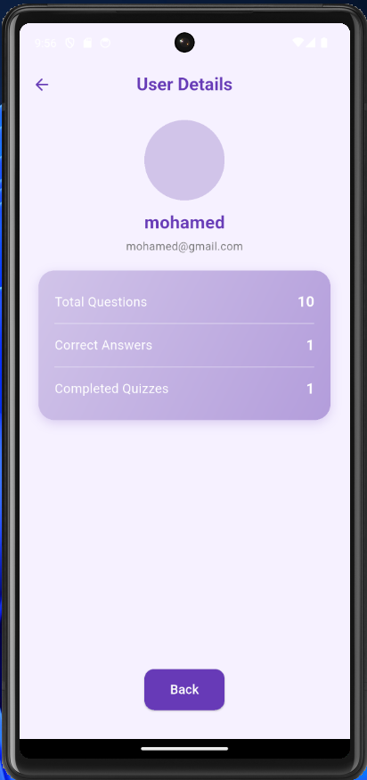

# 📱 Quiz App

A simple and interactive quiz application built with **Flutter**.  
The app allows users to answer questions, upload their profile picture, track their progress, and view results in real-time.

---

## 🚀 Features

- 📝 Multiple choice questions  
- 📊 Score tracking  
- 🌐 Localization (English & Arabic)  
- 🎨 Clean and responsive UI  
- 🔔 Instant feedback on answers  
- 🖼️ Upload profile picture  

---

## 📸 Screenshots

  
  
  

  
  
  

  
  
  

---

## 🛠️ Tech Stack

- **Flutter** (Dart)  
- **Provider / Bloc** for state management  
- **Firebase** (Authentication, Firestore, Storage)  

---

## 📂 Project Structure

